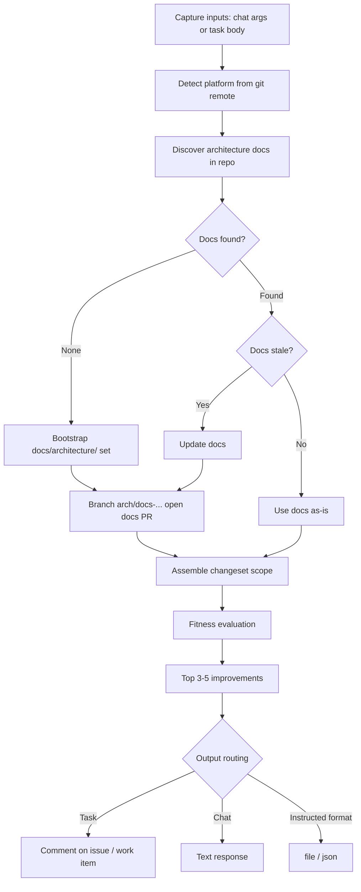

# Architecture Fitness Claude Code Plugin

The **Architecture Fitness** plugin discovers or bootstraps architecture-constraint documents in a repository, opens a docs PR when they are created or updated, then evaluates a requested changeset scope (a PR, a branch, or PRs merged in a date window) against those constraints and reports the **few most important** improvements.

| Agent | Role |
|---|---|
| **arch-doc-curator** | Discover / bootstrap / update `docs/architecture/` and open the docs PR |
| **fitness-evaluator** | Evaluate the changeset against constraints; rank top findings |

Works with **GitHub**, **Azure DevOps**, and any generic git repository.

---

## How It Works



1. **Capture inputs** — CLI args and optional `ARCH FITNESS` config block from an issue / work item.
2. **Discover docs** — scan for constraint-bearing architecture material.
3. **Bootstrap or refresh** — draft or update `docs/architecture/` (`constraints.md`, `fitness-functions.md`, `decisions/`). New/changed rules are `status: proposed`.
4. **Open a docs PR** when docs changed (branch `arch/docs-*` → default branch).
5. **Evaluate the scope in the same run** — using merged docs or the freshly drafted ones (flagged as pending ratification).
6. **Report** the top findings via task comment, chat text, or an instructed format.

---

## Inputs

| Input | Source | Required | Description |
|---|---|---|---|
| Scope | Prompt / task body | No | PR number, branch name, or date-window phrase (`prs merged during last 3 months`) |
| `--pr <n>` | Prompt | No | Evaluate a specific pull request |
| `--since <date>` | Prompt | No | Merged PRs since an ISO date |
| `--issue <n>` | Prompt / rule | No | Attach to a GitHub issue; post comments |
| `--workitem <id>` | Prompt / rule | No | Attach to an Azure DevOps work item; post comments |
| `--docs-only` | Prompt | No | Stop after docs PR |
| `--evaluate-only` | Prompt | No | Skip docs bootstrap; evaluate existing constraints only |
| Focus / Skip areas | Task body | No | Path filters |
| Max findings | Task body / flag | No | Cap on reported improvements (default 5) |
| Output | Task body | No | `comment` \| `file <path>` \| `json` |

The platform is **auto-detected** from `git remote`.

### Task body config block

```
ARCH FITNESS — START
Scope: prs merged during last 3 months
Focus areas: src/payments, src/api
Skip areas: src/legacy
Max findings: 5
Output: comment
Docs mode: auto
ARCH FITNESS — END
```

---

## Sample Prompts

```text
/arch-fitness
/arch-fitness 42
/arch-fitness "prs merged during last 3 months"
/arch-fitness --since 2026-04-16 --issue 123
/arch-fitness --docs-only
/arch-fitness --evaluate-only --pr 42
```

### Focused skills

| Skill | Purpose |
|---|---|
| `/arch-docs` | Docs discovery / bootstrap / update + docs PR only |
| `/arch-evaluate` | Evaluate against existing docs only |

---

## Output

Rendered from [`styles/fitness-report.md`](./styles/fitness-report.md):

- Verdict: `FIT` / `DRIFTING` / `AT RISK`
- Docs PR link (when opened) and ratification status
- Top findings (capped) with evidence and remediation

| Invocation | Destination |
|---|---|
| Task (`--issue` / `--workitem` / Agent rule) | Comment on the issue / work item + `arch-fitness-complete` label/tag |
| Chat | Text response |
| `Output: file` / `json` | Follow the instruction |
| Generic remote | `arch-fitness-report.md` |

---

## Environment Variables

| Variable | Platform | Required | Purpose |
|---|---|---|---|
| `GITHUB-TOKEN` or `GH_TOKEN` | GitHub | Yes | `gh` auth + HTTPS git push |
| `AZURE-DEVOPS-TOKEN` | Azure DevOps | Yes | REST API + HTTPS git push |

See [`docs/platform-setup.md`](./docs/platform-setup.md) for token permissions.

### GitHub token permissions

| Permission | Access | Why |
|---|---|---|
| **Contents** | Read & Write | Read code; push `arch/docs-*` |
| **Metadata** | Read | Repo metadata |
| **Issues** | Read & Write | Read trigger issue; post comments |
| **Pull requests** | Read & Write | Fetch diffs; open docs PR |

### Azure DevOps PAT permissions

| Permission | Access | Why |
|---|---|---|
| **Code** | Read & Write | Diffs, push docs branch, open docs PR |
| **Work Items** | Read & Write | Read work item; post comments; tag |
| **Pull Request Threads** | Read & Write | Optional docs PR thread updates |

---

## Quick Start

```bash
claude --plugin-dir /path/to/xianix-plugins-official/plugins/arch-fitness

# Then in the chat
/arch-fitness
```

Or trigger it automatically via the Xianix Agent by adding a rule — see [Automated Triggering](#automated-triggering-xianix-agent) below and the per-platform guides for [GitHub](./docs/triggers-github.md) and [Azure DevOps](./docs/triggers-azure-devops.md).

---

## Automated Triggering (Xianix Agent)

Add execution blocks to your `rules.json` so the Xianix Agent runs the plugin automatically when a webhook fires. Architecture Fitness attaches to a GitHub **Issue** or Azure DevOps **Work Item** and posts its report back as a comment on that item. It can be started two ways on each platform:

- **Label / tag** — apply the `ai-dlc/arch/fitness` label to an issue (GitHub) or add the `ai-dlc/arch/fitness` tag to a work item (Azure DevOps).
- **Comment mention** — comment `@xianix` on the issue / work item, optionally with an instruction such as `@xianix evaluate PRs merged in the last 3 months`.

Full, copy-pasteable execution blocks for every scenario live in dedicated per-platform guides:

- **[Automated Triggering — GitHub](./docs/triggers-github.md)** — issue opened with the fitness label, label applied to an issue, and `@xianix` comment mentions.
- **[Automated Triggering — Azure DevOps](./docs/triggers-azure-devops.md)** — tag added to a work item, work item created with the tag, and `@xianix` comment mentions.

### Trigger matrix

| Platform | Scenario | Webhook event | Filter rule |
|---|---|---|---|
| GitHub | Issue opened with the fitness label | `issues` | `action==opened` and `ai-dlc/arch/fitness` in `issue.labels` |
| GitHub | Label applied to an issue | `issues` | `action==labeled` and `label.name=='ai-dlc/arch/fitness'` |
| GitHub | `@xianix` comment on an issue | `issue_comment` | `action==created` and `comment.body` contains `@xianix` and not `issue.pull_request?` |
| Azure DevOps | Tag added to a work item | `workitem.updated` | `resource.fields['System.Tags']` contains `ai-dlc/arch/fitness` |
| Azure DevOps | Work item created with the tag | `workitem.updated` (fired after `workitem.created`) | `resource.fields['System.Tags']` contains `ai-dlc/arch/fitness` |
| Azure DevOps | `@xianix` comment on a work item | `workitem.commented` | `resource.fields['System.History']` contains `@xianix` |

The `GITHUB-TOKEN` / `AZURE-DEVOPS-TOKEN` secrets are injected via each block's `with-envs`. Repeated events for the same item are grouped by `conversation-key` (`issue.number` on GitHub, `resource.id` on Azure DevOps). See the per-platform guides for the full blocks.

---

## Generated doc layout

When bootstrapping constraints, the plugin writes:

```
docs/architecture/
├── constraints.md
├── fitness-functions.md
└── decisions/
    └── NNNN-*.md
```

---

## Prerequisites

- Run inside a git repository
- **GitHub:** `gh` CLI + `GITHUB-TOKEN` (see platform setup)
- **Azure DevOps:** `AZURE-DEVOPS-TOKEN`
- **Generic:** local report files only
