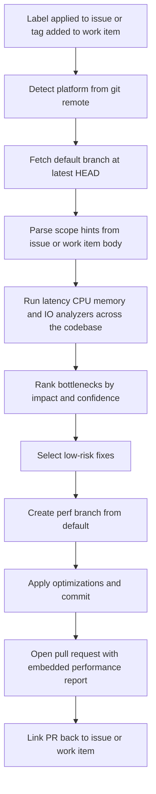

The **Performance Optimizer** performs a **whole-codebase** performance review against the repository's default branch and opens a pull request containing focused, low-risk optimizations together with an embedded performance report.

It is **issue-driven** by default: applying a single label to a GitHub issue (or tagging an Azure DevOps work item) launches the full flow — fetch default branch, analyze, fix, branch, PR, and link back to the originating issue. It can also run on a recurring **schedule** (cron) with no issue or work item at all — see [Automated Triggering](#automated-triggering-xianix-agent) below.

Single trigger label: **`ai-dlc/perf/optimize`** (issue/work-item runs) — or a `schedule` rule set with `--schedule` in `execute-prompt` (cron runs).

It focuses on:

| Capability | What it detects |
|---|---|
| **Latency Bottlenecks** | Slow request paths, expensive synchronous chains, high tail latency patterns |
| **CPU Hotspots** | Costly loops, repeated heavy computation, inefficient algorithms on critical paths |
| **Memory Pressure** | Excess allocations, retention-prone structures, avoidable object churn |
| **I/O and Query Inefficiencies** | N+1 queries, repeated remote calls, blocking I/O, missing batching/caching opportunities |

These capability categories follow common performance engineering practice; thresholds and prioritization are repository-specific and configurable.

Works with **GitHub** (issues) and **Azure DevOps** (work items). The underlying `/perf-optimize` command also runs locally against any git repository.

---

## How It Works



1. **Trigger detection** — webhook fires when `ai-dlc/perf/optimize` is applied to an issue (GitHub) or added as a tag on a work item (Azure DevOps).
2. **Detect platform** — reads `git remote` to confirm GitHub or Azure DevOps.
3. **Fetch default branch** — clones / checks out the latest commit on the repository's default branch. This is the analysis baseline, **not** a PR diff.
4. **Parse scope hints** — inspects the issue / work item body for optional `Scope:` and `Target:` hints; otherwise analyzes the whole codebase.
5. **Analyze bottlenecks** — evaluates latency, CPU, memory, and I/O patterns across the scoped paths.
6. **Prioritize impact** — ranks findings by expected performance gain, confidence, and blast radius.
7. **Apply scoped fixes** — commits selected low-risk optimizations to a new branch named `perf/issue-{number}-<slug>` (GitHub) or `perf/workitem-{id}-<slug>` (Azure DevOps).
8. **Open pull request** — PR title `perf: <issue title>`; PR body includes the full performance report and a `Closes #{number}` / work-item link reference.
9. **Link back** — posts a comment on the originating issue / work item pointing at the new PR.

This keeps the trigger lightweight (one label), moves review effort to the PR where teams already spend it, and still produces a human-readable report alongside actual code changes.

**On a `schedule` (cron) run**, steps 1, 3, and 9 don't apply — there's no label/tag to detect and no issue/work-item body or issue/work-item to link back to. The run still fetches the default branch, but it analyzes **incrementally** by default: only the files changed since the previous scheduled scan (plus their direct callers), with the previous baseline recovered from prior `perf/scheduled-*` PR branch names — no separate state store. A **full** codebase scan still happens on the first run, on the weekly full-scan day (`--full-scan-day`, default Sunday UTC), or whenever the previous baseline can't be recovered; and if nothing analyzable changed since the last scan, the tick skips before doing any analysis at all. Whatever it scans, it opens a **deliberately minimal** PR: instead of applying the whole Quick-wins batch, a scheduled run first keeps only the trivially-safe fixes (high confidence, small localized diff, obviously behavior-preserving) and then, among those, ships the **single highest-impact** one — the biggest win that's still easy to review — with a slim body (no embedded full report, but a `Scan window:` line stating exactly what range was analyzed). Branch/PR naming falls back to the run date and baseline commit, and a Step 0 idempotency check skips the run entirely if a prior scheduled PR is still open — so scheduled runs produce a **steady drip of one small, reviewable fix at a time**, at a per-tick cost that scales with churn rather than repository size. See [Automated Triggering](#automated-triggering-xianix-agent) and `docs/triggers-schedule.md`.

---

## Inputs

| Input | Source | Required | Description |
|---|---|---|---|
| Repository URL | Agent rule | Yes | The repository to analyze — provided by the Xianix Agent rule |
| Default branch | Repository metadata | Yes | Analysis baseline (auto-detected from the remote) |
| Issue number | GitHub webhook payload | Yes (issue-driven, GitHub) | The issue whose label triggered the run |
| Work item ID | Azure DevOps webhook payload | Yes (issue-driven, Azure DevOps) | The work item whose tag triggered the run |
| `ai-dlc/perf/optimize` | Issue label / work item tag | Yes (issue-driven only) | Single trigger for the full analyze-and-fix flow |
| `--schedule` flag | Rule's `execute-prompt` | Yes (scheduled runs only) | Marks the run as a cron trigger with no issue/work item — see `docs/triggers-schedule.md` |
| `--full-scan-day <day>` | Rule's `execute-prompt` | No (scheduled runs only) | UTC day-of-week (`SUN`–`SAT`) on which a scheduled run performs the periodic **full** codebase scan; all other ticks scan incrementally (changes since the last scheduled scan + direct callers). Default: `SUN`. |
| Scope path | Issue / work item body, or `--scope` flag | No | Restrict analysis to a directory or glob — e.g. `Scope: src/services`. Scheduled runs have no body — pass `--scope` in `execute-prompt` instead. |
| Runtime target | Issue / work item body, or `--target` flag | No | Prioritize `api`, `worker`, `frontend`, or `data` — e.g. `Target: api`. Scheduled runs have no body — pass `--target` in `execute-prompt` instead. |

The platform is **auto-detected** from `git remote`. Scope hints are optional; if none are provided, the agent scans the whole codebase.

### Scope hint format

Add any of the following on their own line in the issue or work item body:

```text
Scope: src/services, src/workers
Target: api
```

Multiple comma-separated paths are supported. Paths are matched as globs relative to the repository root.

---

## Sample Prompts

The agent is primarily **webhook-driven** via issue labels. The `/perf-optimize` command can still be invoked locally when you run Claude Code directly.

**Scan the whole codebase on the default branch:**

```text
/perf-optimize
```

**Scan a specific directory:**

```text
/perf-optimize --scope src/services
```

**Scope to a runtime target:**

```text
/perf-optimize --target api
```

**Trigger via GitHub issue:** add the `ai-dlc/perf/optimize` label to the issue. The agent will:

1. Fetch the default branch at its latest commit.
2. Analyze the whole codebase (or the scope declared in the issue body).
3. Open a PR from `perf/issue-{N}-<slug>` containing focused optimizations and the performance report.
4. Comment on the issue linking to the new PR.

**Trigger via Azure DevOps work item:** add the `ai-dlc/perf/optimize` tag to the work item. The agent follows the same flow, creating a branch named `perf/workitem-{id}-<slug>` and a PR that references the work item.

**Trigger on a schedule (cron), no issue or work item:**

```text
/perf-optimize --schedule
```

Configured via a `schedule` rule set (see `docs/triggers-schedule.md`) rather than a webhook. The agent scans **incrementally** — only what changed since the previous scheduled run, with a periodic full scan on the `--full-scan-day` — then creates a branch named `perf/scheduled-{date}-{sha}` and a PR containing a **single** low-risk fix with a slim body, traced by the baseline commit and scan window. The run skips without analyzing if a PR from a prior scheduled run is still open, or if nothing changed since the last scan.

---

## PR Output

Every run produces **one pull request** against the default branch.

**Issue / work-item runs** embed the full analysis in the PR body:

- **Top bottlenecks** ranked by likely user impact
- **Latency risk areas** with estimated request-path effect
- **CPU and memory hotspots** with probable causes
- **I/O and query inefficiencies** with concrete rewrite suggestions
- **Optimization backlog** split into quick wins vs deeper follow-up
- **Per-change rationale** — why each commit matters, expected impact, validation hints
- **Traceability** — `Closes #{issue-number}` (GitHub) or work-item reference (Azure DevOps)

The agent only commits changes for findings it classifies as **low-risk quick wins**. Higher-risk or architectural suggestions are listed in the report's backlog section for human follow-up rather than auto-applied.

**Scheduled runs are deliberately different** — the PR contains a **single** low-risk fix and a **slim body** (one-change rationale + before/after + a short checklist + `Trigger: Scheduled run @ {baseline-sha}` + `Scan window: {last-sha}..{baseline-sha}` or `full @ {baseline-sha}`), with **no** embedded full report. They get **no link-back comment** (step 9 doesn't apply — there's no issue/work item) and are gated by two pre-analysis checks: if a PR from a prior scheduled run is still open against the default branch, or nothing analyzable changed since the last scheduled scan, the tick skips entirely. The intent is a fix a reviewer can approve in under a minute, dripped one at a time, at a cost that scales with churn rather than repository size.

---

## Environment Variables

| Variable | Platform | Required | Purpose |
|---|---|---|---|
| `GITHUB-TOKEN` | GitHub | Yes | Authenticate `gh` CLI for issue reads, branch push, PR creation, and comment publishing |
| `AZURE-DEVOPS-TOKEN` | Azure DevOps | Yes | PAT for REST API calls against work items, code, and pull requests |

### GitHub Token Permissions

The `GITHUB-TOKEN` requires:

| Permission | Access | Why it's needed |
|---|---|---|
| **Contents** | Read & Write | Read repository code, push the new `perf/issue-*` branch |
| **Metadata** | Read | Resolve repository metadata (default branch, etc.) |
| **Issues** | Read & Write | Read the trigger issue body / scope hints and post a link-back comment |
| **Pull requests** | Read & Write | Open the optimization PR and update it with the report |

### Azure DevOps PAT Scopes

The `AZURE-DEVOPS-TOKEN` requires:

| Scope | Access | Why it's needed |
|---|---|---|
| **Code** | Read & Write | Read repository code, push the new `perf/workitem-*` branch |
| **Work Items** | Read & Write | Read the trigger work item body / scope hints and post a link-back comment |
| **Pull Request Threads** | Read & Write | Open the optimization PR and maintain its discussion thread |

---

## Quick Start

```bash
# Point Claude Code at the plugin
claude --plugin-dir /path/to/xianix-plugins-official/plugins/perf-optimizer

# Then in the chat
/perf-optimize
```

Or trigger it automatically via Xianix Agent rules: label a GitHub issue / tag an Azure DevOps work item with `ai-dlc/perf/optimize`, or configure a `schedule` rule set for cron-driven runs.

---

## Automated Triggering (Xianix Agent)

Add an execution block to your `rules.json` so the Xianix Agent runs the plugin automatically — either on a webhook (label/tag) or on a `cron` timer with no webhook at all. The plugin uses **label-based** triggering on GitHub, **tag-based** triggering on Azure DevOps, and a **schedule rule set** for cron-driven runs on either platform.

Full, copy-pasteable execution blocks live in dedicated per-trigger guides:

- **[Automated Triggering — GitHub](./docs/triggers-github.md)** — label applied to an issue (or issue opened with the label already on it).
- **[Automated Triggering — Azure DevOps](./docs/triggers-azure-devops.md)** — tag added to a work item (or work item created with the tag already on it).
- **[Automated Triggering — Schedule](./docs/triggers-schedule.md)** — recurring `cron` run with no issue/work item; opens the same kind of PR, traced by baseline commit instead.

### Trigger matrix

| Trigger type | Platform | Scenario | Webhook event / cadence | Filter rule |
|---|---|---|---|---|
| Webhook | GitHub | Label applied to an issue | `issues` `action==labeled` | `label.name=='ai-dlc/perf/optimize'` |
| Webhook | Azure DevOps | Tag added to a work item | `workitem.updated` | `resource.fields['System.Tags']` contains `ai-dlc/perf/optimize` |
| Schedule | Either | Cron tick, no payload | `cron` (e.g. `0 2 * * *` nightly) | none — every execution in the rule set runs on every tick |

The `GITHUB-TOKEN` / `AZURE-DEVOPS-TOKEN` secrets are injected via each block's `with-envs`, which is **required and `mandatory: true`** — the runtime refuses to start the container if the secret is missing, which is strictly better than discovering it at the first `git push` inside the hook. Webhook rules declare `with-envs` per execution; schedule rule sets typically declare it once at the rule-set level (sibling of `executions`) since credentials don't vary per tick. See the per-trigger guides for the exact PAT scopes.

:::note
Webhook blocks go inside the `executions` array of a `webhook` rule set. Schedule blocks are a top-level `schedule` + `cron` rule set with no `match-any` / `use-inputs`. See [Rules Configuration](/agent-configuration/rules/) for the full file structure and filter syntax, and [Schedule Rule Sets](https://xianix-team.github.io/documentation/agent-configuration/rules/schedules/) for the cron-specific shape.
:::

---

## Safety Invariants

The Performance Optimizer guarantees — enforced by both the orchestrator prompt and the `hooks/validate-prerequisites.sh` PreToolUse hook — that:

- **The default branch is never pushed to.** All changes go on a new `perf/issue-*`, `perf/workitem-*`, or `perf/scheduled-*` branch.
- **Only Quick-win findings are ever applied automatically.** Architectural rewrites are surfaced as _Deeper follow-up_ in the embedded report, never auto-applied.
- **Every optimization commit is scoped and documented.** One commit per finding, prefixed `perf:`, with file + line reference.
- **The PR body always embeds the full performance report** so reviewers see analysis and code side by side.
- **A scheduled run never opens a second PR on top of an already-open one.** The orchestrator checks for an open `perf/scheduled-*` PR against the default branch before doing any analysis, and skips the run entirely if one is found.
- **A scheduled incremental run analyzes only what changed.** Files changed since the previous scheduled scan plus their direct callers — nothing else; unchanged code is revisited only by the periodic full scan (`--full-scan-day`). If the previous baseline can't be recovered, the run degrades to a full scan, never to an error.

---

## What's in this plugin

```
perf-optimizer/
├── .claude-plugin/
│   ├── plugin.json          # Manifest
│   ├── settings.json        # Default agent
│   └── .lsp.json            # Language servers (TypeScript, C#, Python, Go)
├── commands/
│   └── perf-optimize.md     # Slash command entry point
├── agents/
│   ├── orchestrator.md      # Whole-codebase controller
│   ├── latency-analyzer.md
│   ├── cpu-analyzer.md
│   ├── memory-analyzer.md
│   ├── io-query-analyzer.md
│   └── perf-pr-author.md    # Quick-win applier + PR opener
├── skills/
│   ├── analyze-performance/SKILL.md
│   └── create-perf-pr/SKILL.md
├── providers/
│   ├── github.md            # Issues + PRs via gh CLI
│   └── azure-devops.md      # Work items + PRs via REST
├── styles/
│   └── report-template.md
├── hooks/
│   ├── hooks.json
│   ├── validate-prerequisites.sh
│   └── notify-push.sh
├── docs/
│   ├── platform-setup.md
│   ├── triggers-github.md
│   ├── triggers-azure-devops.md
│   └── triggers-schedule.md
└── README.md
```

---

## License

MIT — same as the rest of this marketplace.
