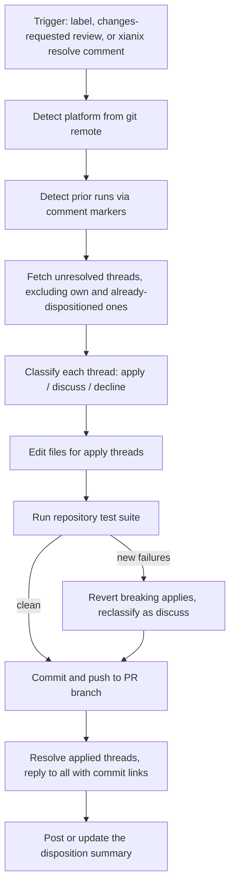

The **PR Comment Resolver** works through every unresolved review thread on a pull request and closes the loop that reviewers open: clear, actionable comments become **verified, pushed commits**; everything else gets an explicit, reasoned reply. A single structured **disposition summary** on the PR shows what was applied, what needs human discussion, and what was declined — with clickable commit links.

| Disposition | Meaning | What the plugin does |
|---|---|---|
| **Apply** | Clear, unambiguous, safe-to-automate change | Edits the files, verifies with the repo's test suite, commits, pushes, resolves the thread, replies with the commit link |
| **Discuss** | Needs human judgement — design tradeoff, unclear intent | Leaves the thread open with a short explanation of what must be decided |
| **Decline** | Factually wrong, conflicts with an accepted decision, or out of scope | Leaves the thread open with a neutral justification |
| **Decline (non-code)** | Praise, questions, process talk — no code change requested | Auto-declined with a fixed reply |

Works with **GitHub**, **Azure DevOps**, and any generic git repository (report written to a local file).

---

## How It Works



1. **Index & detect** — builds a structural index of the codebase, detects the platform from `git remote get-url origin` (authoritative over any `PLATFORM` hint), and resolves the PR number and open/merged state.
2. **Detect prior runs** — every comment the plugin posts carries an invisible HTML marker (`<!-- pr-comment-resolver:v1 … -->`); a re-run finds its earlier progress/summary comments and updates them in place instead of duplicating.
3. **Fetch & filter threads** — pulls every unresolved review thread (GraphQL on GitHub, REST on Azure DevOps), skipping its own comments and threads a prior run already dispositioned. A thread where a human replied after the plugin's response comes back into scope.
4. **Classify** — each remaining thread gets one disposition: apply, discuss, or decline.
5. **Apply & verify** — apply-classified edits are made with targeted edits, then the repository's **test suite runs** (auto-detected: `dotnet test`, `npm test`, `pytest`, `go test`, …). Applies that introduce **new** failures relative to the pre-edit baseline are reverted and reclassified as discuss. A PreToolUse hook **blocks `git push` until the verification step has recorded a result**.
6. **Commit, push, close the loop** — one commit for all surviving applies, pushed to the PR branch; applied threads are marked resolved with a reply linking the commit; discuss/decline threads get their explanations; the summary comment is posted — or, on a re-run, updated in place with cumulative totals and a run history.

### Merged PR handling

If the target PR is already merged, the plugin cuts a new branch from the merge commit, applies (and test-verifies) the changes there, pushes it, and opens a follow-up PR linked back to the original.

### Re-run behavior

Running again on the same PR is safe and incremental: only threads not yet dispositioned are processed, the progress comment is reused, and the existing summary is edited in place (cumulative totals + per-run history) — never stacked.

---

## Inputs

| Input | Source | Required | Description |
|---|---|---|---|
| Repository URL | Agent rule | Yes | The repository to work on — provided by the Xianix Agent rule |
| PR number | Prompt / webhook payload | No | Target a specific pull request; defaults to the open PR for the current branch |

The platform (GitHub, Azure DevOps, generic) is **auto-detected** from `git remote` — you don't need to specify it.

---

## Sample Prompts

**Resolve comments on the current branch's PR:**

```text
/resolve-comments
```

**Resolve comments on a specific PR:**

```text
/resolve-comments 42
```

**Re-post the disposition summary** (when a prior run compiled dispositions but the posting step didn't complete):

```text
/post-summary 42
```

`/resolve-pr-comments` is an alias for the full `/resolve-comments` procedure.

---

## Environment Variables

The Xianix Agent reads these from its secrets store and injects them at runtime via the rule's `with-envs` block (see [Automated Triggering](#automated-triggering-xianix-agent) below). For local CLI use, export them in your shell.

| Variable | Platform | Required | Purpose |
|---|---|---|---|
| `GITHUB-TOKEN` | GitHub | Yes | Authenticate `gh` for fetching threads, posting replies, resolving threads, and pushing commits |
| `AZURE-DEVOPS-TOKEN` | Azure DevOps | Yes | PAT for REST API calls and `git push` |

### Optional Tuning Variables

| Variable | Default | Purpose |
|---|---|---|
| `PR_RESOLVER_RUN_TESTS` | `true` | Set to `false` to skip test verification before pushing (e.g. suites too slow for the container budget). The skip is recorded and surfaced in the disposition summary. |

### GitHub Token Permissions

| Permission | Access | Why it's needed |
|---|---|---|
| **Contents** | Read & Write | Read repo files, commit changes, push to branches |
| **Metadata** | Read | Access repository metadata |
| **Pull requests** | Read & Write | Fetch threads, post replies, resolve threads, open follow-up PRs |

### Azure DevOps PAT Scopes

| Scope | Access | Why it's needed |
|---|---|---|
| **Code** | Read & Write | Fetch PR metadata, push the resolution commit |
| **Pull Request Threads** | Read & Write | Fetch threads, post replies, update thread statuses, post the summary |

---

## Execution Runtimes

Automated runs provision language runtimes on demand with [mise](https://mise.jdx.dev) — the repository's own version files (`global.json`, `.nvmrc`, `.tool-versions`, …) are authoritative, and missing runtimes are auto-installed on first use, so the test-verification step always has the repo's toolchain available. Nothing needs configuring in this plugin. See [`docs/platform-setup.md`](./docs/platform-setup.md#execution-runtimes-mise).

---

## Quick Start

```bash
# Point Claude Code at the plugin
claude --plugin-dir /path/to/xianix-plugins-official/plugins/pr-comment-resolver

# Then in the chat
/resolve-comments 42
```

Or trigger it automatically via the Xianix Agent by adding a rule — see [Automated Triggering](#automated-triggering-xianix-agent) below and the per-platform guides for [GitHub](./docs/triggers-github.md) and [Azure DevOps](./docs/triggers-azure-devops.md).

---

## Automated Triggering (Xianix Agent)

Add execution blocks to your `rules.json` so the Xianix Agent runs the plugin automatically when a webhook fires. The plugin uses **label-based** triggering on GitHub and **`@xianix resolve` comment-mention** triggering on Azure DevOps (Azure DevOps webhook payloads don't include label data). Both keep resolution **opt-in per PR** — important because it pushes commits to the author's branch.

Full, copy-pasteable execution blocks live in dedicated per-platform guides:

- **[Automated Triggering — GitHub](./docs/triggers-github.md)** — resolve label applied to a PR, and changes-requested review submitted on a labeled PR.
- **[Automated Triggering — Azure DevOps](./docs/triggers-azure-devops.md)** — `@xianix resolve` comment mention on a PR.

### Trigger matrix

| Platform | Scenario | Webhook event | Filter rule |
|---|---|---|---|
| GitHub | Resolve label applied to a PR | `pull_request` | `action==labeled` and `label.name=='ai-dlc/pr/resolve-comments'` |
| GitHub | Changes-requested review on a labeled PR | `pull_request_review` | `action==submitted` and `review.state=='changes_requested'` and `ai-dlc/pr/resolve-comments` in `pull_request.labels` |
| Azure DevOps | `@xianix resolve` comment on a PR | `ms.vss-code.git-pullrequest-comment-event` | `resource.comment.commentType=='text'` and `resource.comment.content` contains `@xianix resolve` |

The `GITHUB-TOKEN` / `AZURE-DEVOPS-TOKEN` secrets are injected via each block's `with-envs` (`mandatory: true`). The `conversation-key` (`pull_request.number` on GitHub, `resource.pullRequest.pullRequestId` on Azure DevOps) groups repeated events for the same PR into one conversation so re-runs share prior context.

:::note
These blocks go inside the `executions` array of a rule set. See [Rules Configuration](/agent-configuration/rules/) for the full file structure and filter syntax.
:::

---

## Safety Invariants

The PR Comment Resolver guarantees — enforced by both the orchestrator procedure and the `hooks/validate-prerequisites.sh` PreToolUse hook — that:

- **Nothing is pushed unverified.** The hook blocks `git push` until the test-verification step has recorded a result (`pass`, `no-tests`, or an explicit `PR_RESOLVER_RUN_TESTS=false` skip). Applies that break previously-passing tests are reverted and reclassified as **discuss**, never pushed.
- **Only clear, unambiguous changes are applied automatically.** Anything needing judgement stays an open thread with a reasoned reply — resolution of discuss/decline threads remains with humans.
- **Pushes go only to the PR's head branch** (or a new `fix/pr-<n>-review-comments` branch for merged PRs) — never to the default branch.
- **Re-runs never duplicate.** Comment markers make every run idempotent: prior dispositions are skipped, the progress comment is reused, and the summary is updated in place with a run history.
- **Every commit reference is a clickable link** to the platform's commit page, and every reply names the file, line, and reason.

---

## What's in this plugin

```
pr-comment-resolver/
├── .claude-plugin/
│   ├── plugin.json              # Manifest
│   ├── settings.json            # Default agent
│   └── .lsp.json                # Language servers
├── commands/
│   └── resolve-comments.md      # Slash command entry point
├── agents/
│   └── orchestrator.md          # Authoritative step-by-step resolution flow
├── skills/
│   ├── resolve-pr-comments/SKILL.md   # Alias for the full flow
│   └── post-summary/SKILL.md          # Re-post/update the summary from compiled dispositions
├── providers/
│   ├── github.md                # gh CLI + GraphQL threads, markers, commit links
│   ├── azure-devops.md          # REST threads, markers, commit links
│   └── generic.md               # Local report fallback
├── styles/
│   ├── disposition.md           # Reply templates, tone, marker rules
│   └── report-template.md       # Disposition summary structure + run history
├── hooks/
│   ├── hooks.json
│   ├── validate-prerequisites.sh  # Env checks + test-verification push gate
│   └── notify-push.sh
├── docs/
│   ├── platform-setup.md
│   ├── triggers-github.md
│   └── triggers-azure-devops.md
└── README.md
```

---

## License

MIT — same as the rest of this marketplace.
